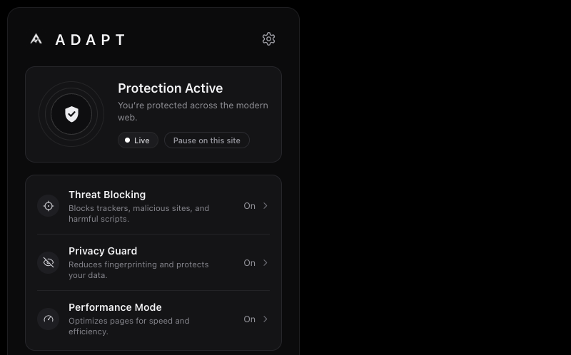
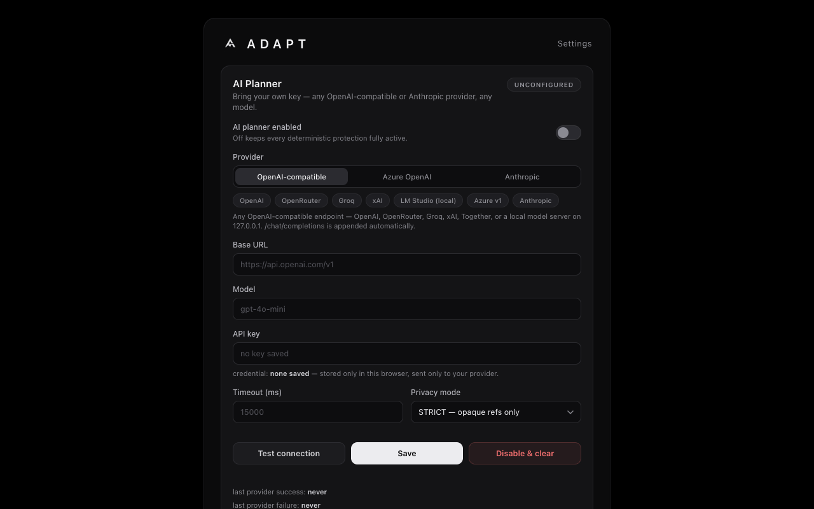

<p align="center">
  
</p>

<h1 align="center">ADAPT — Adaptive Content &amp; Privacy Blocker</h1>

<p align="center">
  A Manifest V3 blocker that doesn't just apply lists — it <strong>observes how each site fights back, and adapts</strong>.
</p>

<p align="center">
  
  
  
  
</p>

<p align="center">
  
  &nbsp;&nbsp;
  
</p>

---

## Why ADAPT exists

Every mainstream blocker applies the same static lists everywhere and hopes. Modern sites know this — they ship bait elements, detector probes, re-hide wars, and anti-adblock walls tuned to exactly those lists.

ADAPT keeps a battle-tested static plane **and adds a transactional adaptation engine** on top: when a page reacts to blocking, ADAPT stages the smallest possible counter-response as a **reversible transaction**, measures whether page health actually improved, and **rolls back instantly if it didn't**. What works becomes a per-site recipe that loads before first paint on your next visit. What doesn't work is never kept.

## Features

- **Static plane — 188,203 rules.** EasyList/EasyPrivacy-family network and cosmetic filters compiled into 16 declarativeNetRequest rulesets, evaluated locally by Chrome. Zero network fetches, zero update beacons.
- **Transactional adaptation engine.** Every intervention is staged, observed against a 10-axis page-health vector, and promoted or rolled back on evidence — never on hope. Learned recipes persist per site and replay pre-paint.
- **Protected Transaction Mode.** The moment you start a sign-in, payment, or captcha flow, ADAPT fails open inside that tab's frame tree — bank 3DS pages and enterprise SSO just work — then restores full protection when the flow ends.
- **Optional AI planner — bring your own key.** Connect **any OpenAI-compatible endpoint or Anthropic** — OpenAI, OpenRouter, Groq, xAI, Azure, Together, or a local LM Studio server; any model. Strictly budgeted (≤2 calls per navigation), validated by a policy engine, and **STRICT privacy mode**: the planner receives only opaque labels, health scores, and hashed references — never URLs, hostnames, or page content. No key configured = zero AI traffic. The extension ships with **no built-in endpoint and no key**.
- **Per-site pause.** One click in the popup stands protection down on a site you trust — blocking planes, learned recipes, content runtime, even the popup broker — and one click brings it back. Survives restarts.
- **Privacy by construction.** No telemetry, no analytics, no crash reporting, no developer servers, no remote code. All state lives in your browser's local extension storage. See [`store/PRIVACY_POLICY.md`](store/PRIVACY_POLICY.md).
- **Stealth plane.** Main-world shims mask automation surfaces before page scripts run, with zero fingerprintable markers (no `data-*` attributes, no branded globals — verified by an adversarial probe fixture).

## Install (developer mode — 60 seconds)

1. **Download** the latest `adapt-1.0.1.zip` from [**Releases**](../../releases) and **unzip it** — you get an `adapt-1.0.1/` folder (with `manifest.json` inside).
2. Open **`chrome://extensions`** in Chrome.
3. Toggle **Developer mode** (top right).
4. Click **Load unpacked** and select the unzipped folder.
5. Pin ADAPT to the toolbar — the popup shows **Protection Active** on your next page.

> Loading unpacked requires the folder to stay on disk — put it somewhere permanent (e.g. `~/Extensions/`) before step 4.

### Updating an existing install

Unpacked extensions don't auto-update, but updating keeps all your settings and learned rules:

1. **Download** the newest zip from [**Releases**](../../releases).
2. **Unzip it over your existing ADAPT folder** (replace the old files — same location you loaded from). If you no longer know where it is: `chrome://extensions` → ADAPT → *Loaded from*.
3. On `chrome://extensions`, hit the **reload** button on the ADAPT card.

Done — version 1.0.1's card shows the new version number. Your paused sites, AI settings, and learned rules all survive (they live in extension storage, not the folder). If you ever load the new zip from a *different* folder instead, Chrome treats it as a fresh install and you'll re-enter your AI key — same-location replacement avoids that.

### Build from source instead

```bash
git clone https://github.com/basimrdj/adapt.git
cd adapt
npm ci
npm run build:full     # regenerates the 16-ruleset static plane + page-filtering plane
```

Then load `dist/` unpacked as above. Requires Node 22+; the build is deterministic and needs no credentials.

## Setting up the AI planner (optional — works great without it)

Click the **gear** in the popup → **AI Planner**:

| Preset | Base URL | Notes |
|---|---|---|
| OpenAI | `https://api.openai.com/v1` | any `gpt-*` model |
| OpenRouter | `https://openrouter.ai/api/v1` | hundreds of models, one key |
| Groq | `https://api.groq.com/openai/v1` | fast inference |
| xAI | `https://api.x.ai/v1` | Grok models |
| LM Studio (local) | `http://127.0.0.1:1234/v1` | fully local, zero cloud |
| Azure v1 | your `*.openai.azure.com/openai/v1` | your deployment |
| Anthropic | `https://api.anthropic.com` | any Claude model |

Paste your key, pick a model, hit **Test connection** — the test runs through the production transport and production policy validator, so a green result means the real path works. **Save** and you're done. Your key is stored only in Chrome's local storage and is sent only to the endpoint you chose. Reasoning models (gpt-5 family), translating proxies, and older servers are handled automatically: the planner negotiates the request dialect per endpoint and enforces the plan schema server-side where supported.

## How it's verified

This project treats verification as a first-class feature. Every claim above is backed by an executable gate in this repo:

| Gate | Result | Re-run |
|---|---|---|
| Unit suite (56 files) | **365/365** | `npm run test:unit` |
| End-to-end in real Chromium (12 files) | **90/90** | `npm run test:e2e` |
| Real-world audit — 68 sites, ON vs OFF | **0 breakage** | `npm run verify:realworld` |
| Live autonomy holdout — 96 unseen adversarial mechanisms | **96/96, 0 false positives** | `npm run verify:autonomy:live` |
| STRICT privacy proof — planner payloads | **no URL/host/content, proven** | `npm run verify:privacy` |
| Packaged artifact in a clean profile | **5/5** | `npm run pack && npm run verify:packaged` |

Evidence artifacts from the latest runs live under [`artifacts/`](artifacts/) — including the honest limits (closed-shadow blindness, first-party inline telemetry, re-hide war endgames).

## Architecture in one paragraph

`src/background/` holds the deterministic core: the DNR controller (band-allocated rule IDs, quota tracking, startup reconcile), the causal orchestrator (autonomy + survivor intelligence), protected transactions, the pause manager, and the multi-provider AI planner. `src/page/` holds the in-page planes: sensor, cosmetic/page filtering runtime, DOM actions with bounded re-hide, and stealth shims. `src/entrypoints/` wires it together (service worker, content script, popup, options). The 188k-rule static plane is compiled at build time by `tools/phase31/`. Deeper reading: [`docs/`](docs/) and the ADRs in [`docs/adr/`](docs/adr/).

## Contributing

Issues and PRs welcome. Ground rules: no telemetry, no remote code, no site-specific hacks (an over-blocked resource class becomes a fix or a documented exception in the lists pipeline), and `npm run test:unit && npm run test:e2e` must stay green. The release gates (`npm run pack`, `verify:packaged`) run in CI on every push.

## License

[GPL-3.0](LICENSE) — the same license as uBlock Origin. Free to use, study, modify, and share; derivatives must stay open.
